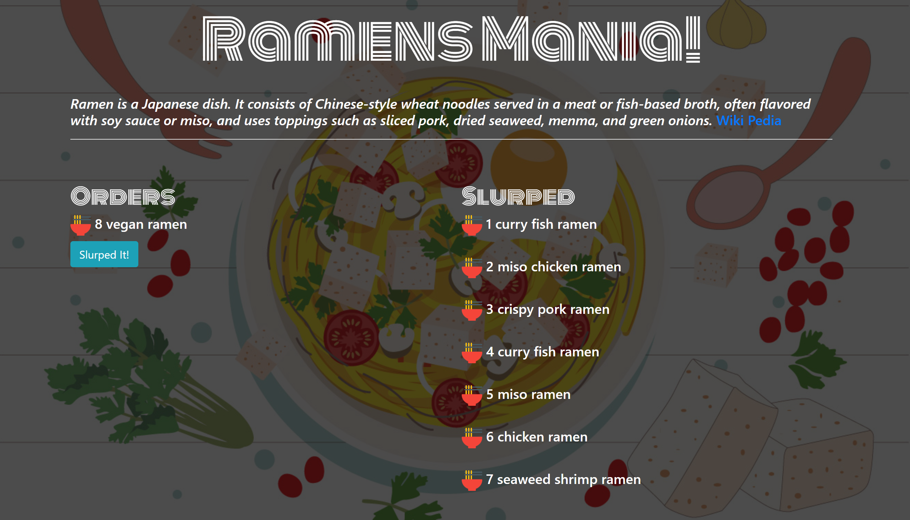

# Ramen Mania

Ramen Mania is an interactive app for all ramen lovers. The users can input their ramen orders in and hit the submit button. The orders will display on the left side. The users can slurp (eat) the ordered ramen by clicking on the slurp it button. Once slurped, the ordered ramen will move to the right side (eaten/slurped). This app was created with Node JS, Express, Handlebars, HTML, CSS, Javascript, ORM, and SQL.

# Watch Demo

https://vimeo.com/259594927
